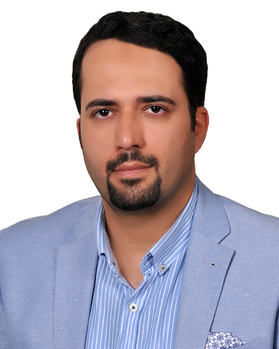

## معرفی

:تحصیلات
- پسادکترا: مهندسی داده، دانشکده مهندسی داده، دانشگاه ماستریخت، ماستریخت، هلند (۱۳۹۴)
- دکترا: علوم کامپیوتر، دانشکده علوم کامپیوتر، دانشگاه لایدن، لایدن، هلند (۱۳۹۱)
- کارشناسی‌ارشد: مهندسی کامپیوتر (هوش مصنوعی)، دانشکده مهندسی کامپیوتر، دانشگاه صنعتی شریف، تهران، ایران (۱۳۸۷)
- کارشناسی: مهندسی کامپیوتر (نرم‌افزار) ،دانشکده برق و کامپیوتر، دانشگاه تهران، تهران، ایران (۱۳۸۵)

:زمینه های پژوهشی
- داده‌کاوی، متن‌کاوی، گراف‌کاوی
- آنالیز داده، استخراج الگو
- کلان داده
- بایوانفورماتیک

---
