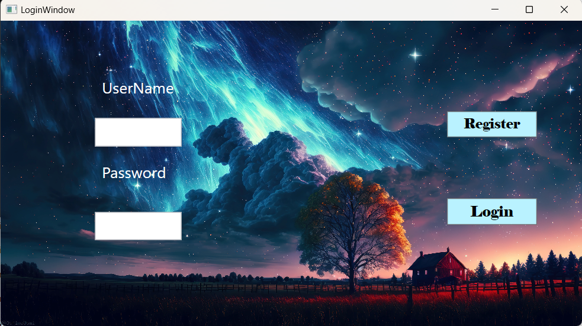
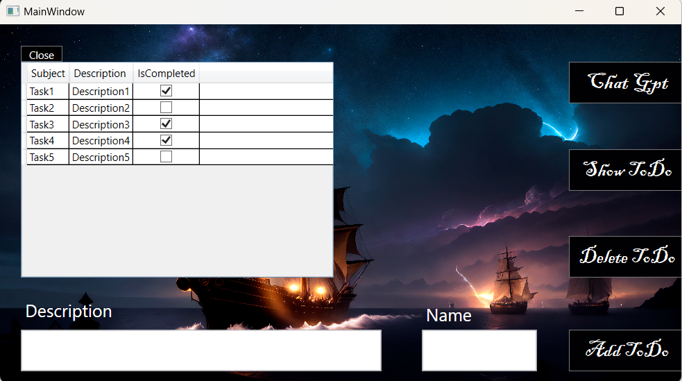
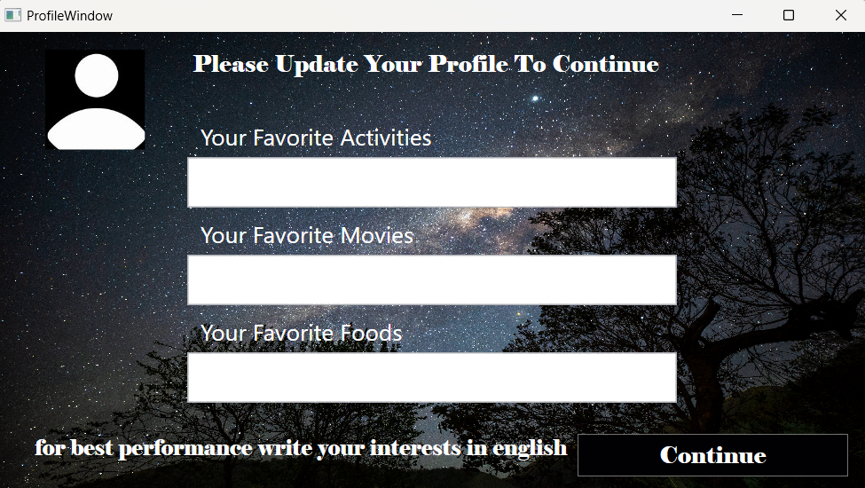
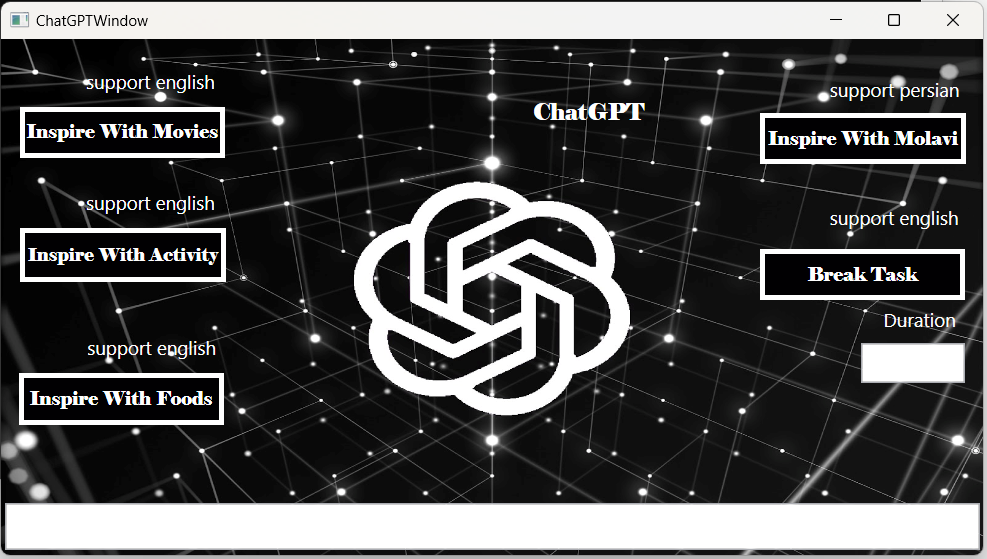

## معرفی اولیه
هدف این پروژه طراحی و پیادهسازی یک اپلیکیشن بسیار ساده به صورت حرفه ای و رعایت اصول طراحی ورعایت اصول طراحی و پیاده سازی سالید با استفاده از فناوری ها  و بسترهای نرم افزاری نوین بود
 اپلیکیشن ما مانند اپلیکشن گوگل تسک و مایکروسافت تودو است
## نرم افزار ما داری بخش های زیر میباشد:
- DataBase
- ماژول CRUD
- ماژول Web Api
- ماژول هوش مصنوعی با تعریف امکانات هوشمند برای ارسال پرامپت ها 
- Swagger
- SignalR
- واسط کاربری wpf
- واسط کاربری blazorServer
- واسط کاربری blazorWasm
- واسط کاربری cmd
- چند کاربره بودن نرم افزار در تمامی کلاینت ها

### روند کار
در ابتدای کار مهم ترین بخش فکر  کردن است و ایده و تصور اینکه اپلیکشن ما قراراست چجوری بشود و چه بخش هایی داشته باشد
دومین مرحله یادگیری مفهوم های هربخش است مثلن اینکه  وظیفه بخش ای پی آی چیست 
در ابتدا چون از اول ترم ما بسیار با دبلیو پی اف کار کردیم ابتدا من از این کلاینت شروع کردیم
یو آی انرا با ویژوال استودیو انجام دادم
سپس مرحله به مرحله هربخش را جلو بردم درست کردن صفحه لاگین به من کمک کرد تا چگونگی ارتباط با دیتابیس را بهتر درک کنم
سپس متدای لازم را در ای پی آی نوشتم و توسط سوگر تغیرات را در دیتابیس اعمال کردم
تا حد ممکن سعی کردم که ظاهر کلاینت هایم شبیه هم باشد که این بخش هم پیچیدگی ها خودش را داشت
برای بخش هوش مصنوعی  و ایجاد پرامپت مناسب بارها در چت جی پی تی سوال هایی پرسیدم تا بهترین جواب را دریافت کنم
همچنین برای اطمینان از درست کار کردن بخش هایی از پروژه ام تست هایی نوشتم

[You-Can-See-SourceCode-OfMyProject-In-Github](https://github.com/sanyamasoudi/ToDoManagerApp)
-----------------------------------------------------------------------