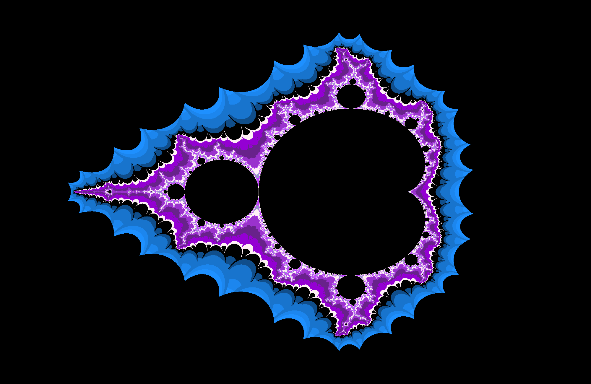
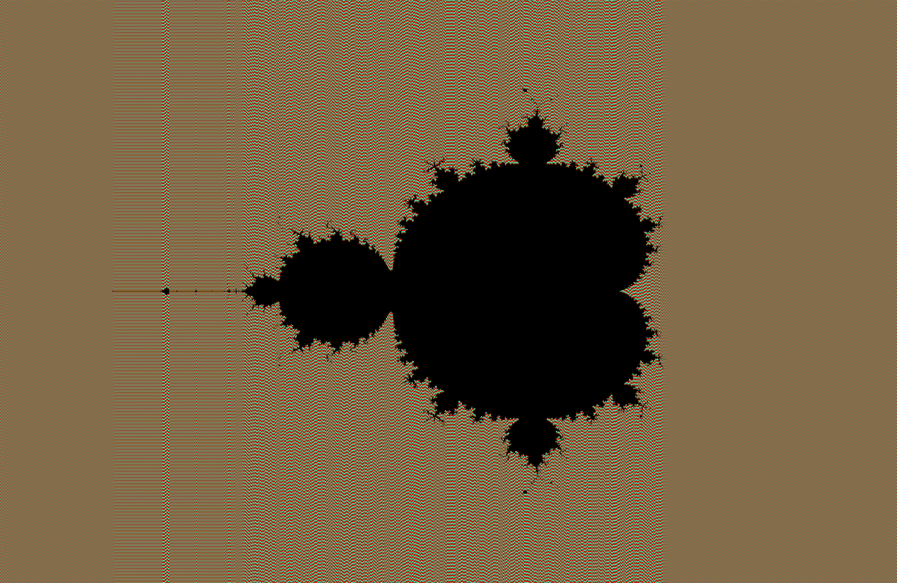

## مندلبرات چیست
- در قدم اول ما راجب مندلبرات و فرکتال ها تحقیق کردیم و دریافتیم معادله مندلبرات به صورت زیر است
- f(z)=z*z + c
- [اطلاعات-بیشتر](https://en.wikipedia.org/wiki/Mandelbrot_set)
## پیاده سازی اولیه
- برای پیاده سازی و تولید اولیه ما از زبان پایتون استفاده کردیم تا با شیوه رنگ امیزی ار جی بی و اچ اس وی و همچنین با مفاهیم مکس ایتریشن اشنا شویم
- بدین منظور از سایت زیر استفاده کردیم و با دیباگ کردن و تغیردادن بخش های مختلف  به الگوریتم ان پی بردیم 
- [codingame](https://www.codingame.com/playgrounds/2358/how-to-plot-the-mandelbrot-set/mandelbrot-set)
## تولید عکس در زبان سی
- با استفاده از ساختار کلی تولید عکس و فهم الگوریتم مندلبرات در پایتون انرا در زبان سی پیاده سازی کردیم

## پیاده سازی توابع
- در مرحله بعد ما هر یک از توابع را جداگانه در قسمت مین زدیم و دستی و به دور از استفاده از تابع اپدیت ایمیج انهارا تست کردیم
- برای یافتن مختصات دقیق نقاط برای زوم دچار مشکل شدیم فلذا از سایت زیر کمک گرفتیم
- [geogebra](https://www.geogebra.org/m/mfewjrek)
- با دانلود نرم افزار زیر هم با کلیک بر روی هر نقطه در مندلبرات مختصات دقیق ان را به ما میدهد
- البته کاربرد بیشتر ان در خصوص تولید موسیقیست
- [fractal-music-generator](https://betazeta.itch.io/fractal-music-generator)

- در نهایت تمام توابع را در ساختار اصلی وارد کرده 
## نوشتن کانفینگ براساس ذائقه
## ffmpeg
- با استفاده از لینک زیر انرا نصب و اجرا کردبم
- [ffmpeg](https://www.wikihow.com/Install-FFmpeg-on-Windows)
- سپس با استفاده از دستور زیر همه عکس ها رابه ویدیو تبدیل کردیم
- .. ffmpeg -r 5 -i %05d.bmp -c:v libx264 -vf fps=25 -pix_fmt yuv420p out.mp4 ..
## sonicpi
- با مشاهده کارگاه های سال گذشته راجب سانیک پای و مطالعه تئوری موسیقی به صورت بیسیک یک ریتم ساده نواختیم
- [best-Site-that-help-me-to-play-a-song](https://latouchemusicale.com/en/best-piano-songs-with-easy-chords/)
- [i-love-this-too](https://sonic-pi.mehackit.org/exercises/en/09-keys-chords-and-scales/01-piano.html)
- سپس طبق زمان هایی که در ویدیو اول درست کردیم موسیقی را سینک میکنیم باهاش
- در نهایت با استفاده از دستور زیر در سی ام دی موسیقی رو هم به ویدیومون اضافه میکنیم
- .. ffmpeg -r 5 -i %05d.bmp -c:v libx264 -vf fps=25 -pix_fmt yuv420p out.mp4 ..
## در مرحله اخر از نتیجه کارمون لذت میبریم:)

[you-can-see-my-project-in-reddit](https://www.reddit.com/user/sani_msd/comments/10k31ek/mandelbrot/?utm_source=share&utm_medium=web2x&context=3)
-----------------------------------------------------------------------